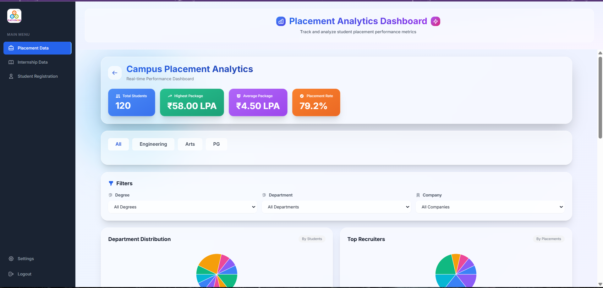
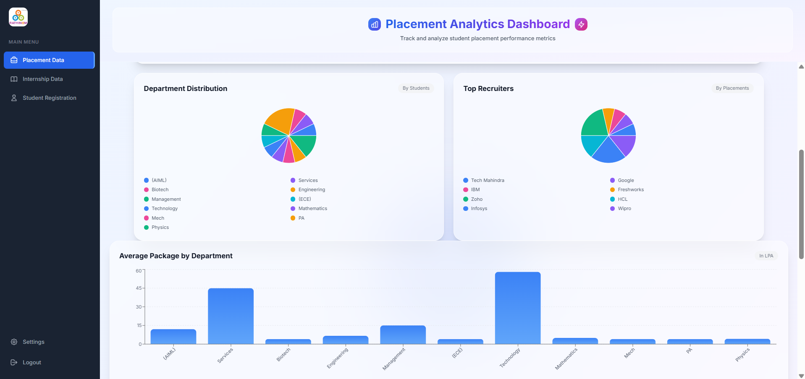
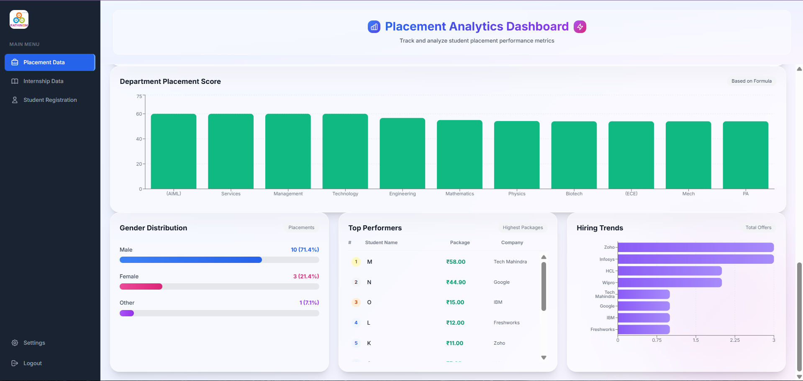
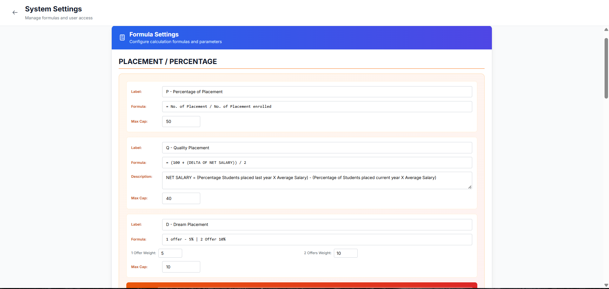
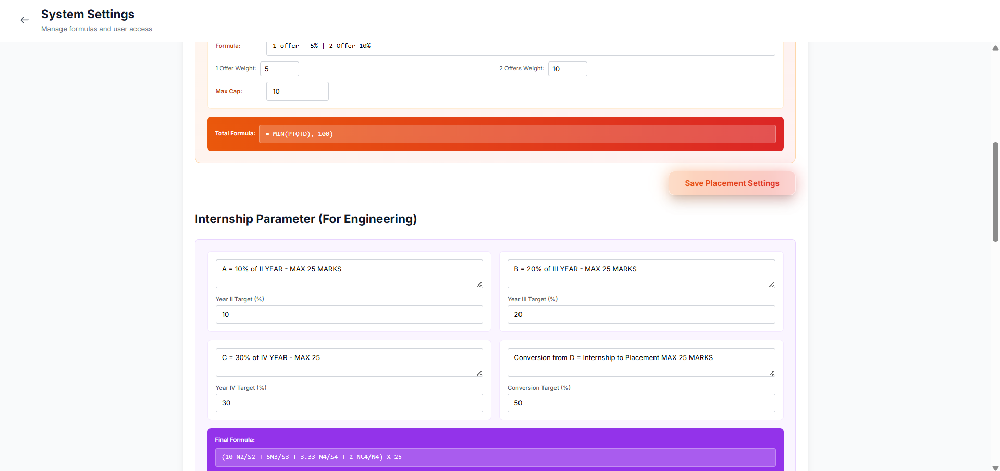
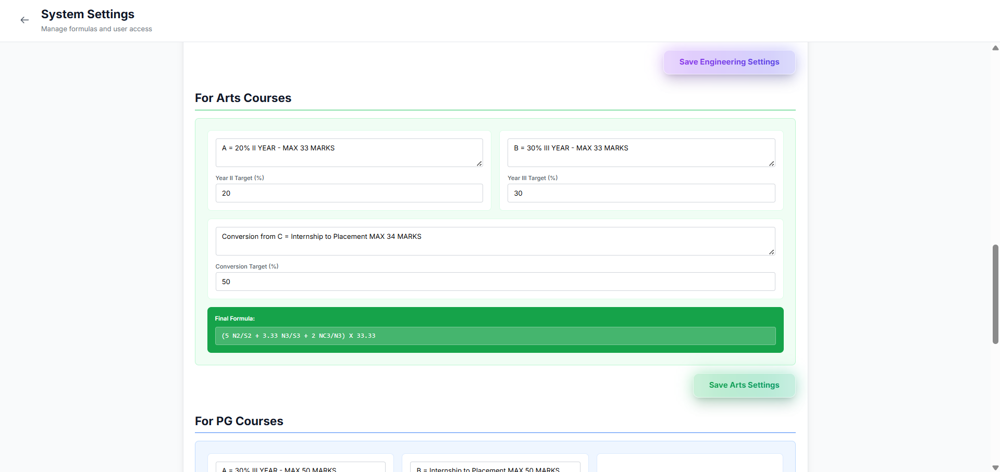
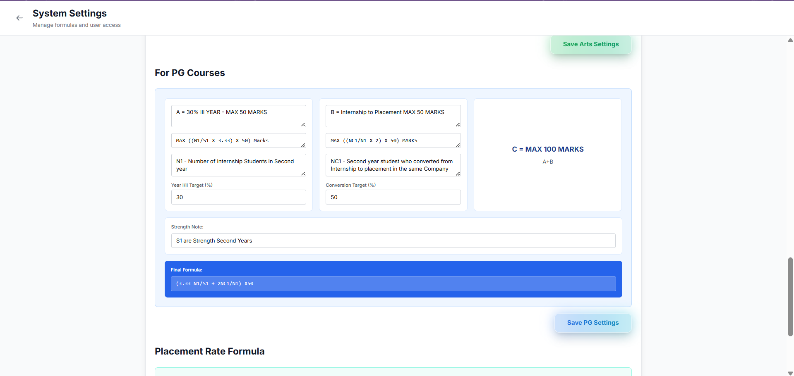
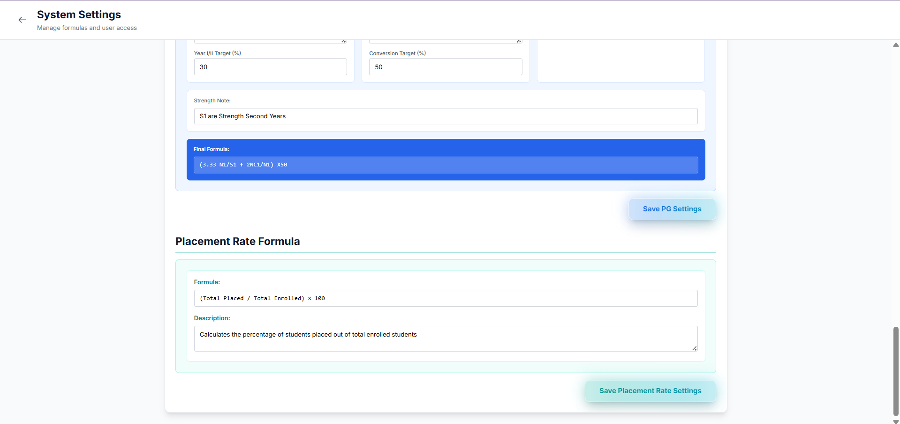
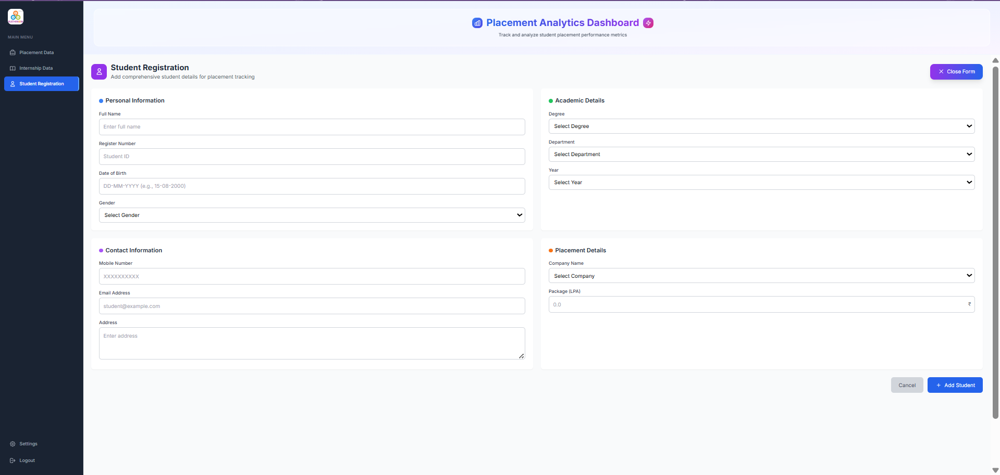
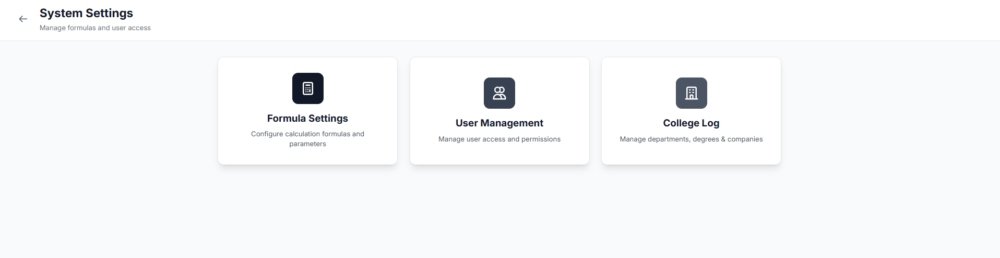

# EduMetric — Institutional Placement Intelligence System

A full-stack analytics platform designed to track, analyze, and optimize student placement and internship performance across multiple academic programs.

## 🚀 Overview

EduMetric was developed as a decision-support system for institutional leadership (CEO, AGM, IT Head) to replace fragmented, manual placement tracking with a structured, data-driven platform.

The system enables real-time analytics, configurable scoring models, and department-wise performance insights across engineering, arts, management, pharmacy, and physiotherapy programs.

---

## 🎯 Problem

Educational institutions often rely on disconnected spreadsheets and manual processes to track placement outcomes, leading to:

- Inconsistent reporting across departments  
- Lack of standardized performance metrics  
- Delayed decision-making for leadership  

---

## 💡 Solution

EduMetric introduces a centralized PERN-based system with:

- Configurable formula engine for placement and internship scoring  
- Real-time dashboards with department-wise analytics  
- Multi-role authentication with secure administrative controls  
- Structured student data management with filtering and tracking  

---

## 📊 Impact

- Handles **10,000+ student records annually**  
- Reduced reporting turnaround time by **~40%**  
- Enabled real-time performance tracking across multiple departments  
- Improved data consistency and decision visibility for leadership  

---

## 🏗️ System Architecture

- **Frontend:** React + TypeScript + Tailwind CSS  
- **Backend:** Node.js + Express.js  
- **Database:** PostgreSQL  
- **Visualization:** Recharts  

---

## 🔐 Note on Source Code

This repository contains a prototype and system overview.

The production system is currently used internally by the institution.  
Due to ownership and data confidentiality, the full source code is not publicly available.

---

## 📸 Screenshots

### Dashboard Views

### Formula Configuration

### Student Management

### System Settings

---

## 🎯 Use Cases

- Placement tracking for educational institutions  
- Internship performance monitoring  
- KPI-based academic analytics  
- Administrative decision support systems  

---

## 📌 Author

Jerom Issac T S  
Full-Stack Developer | Data-Driven Systems  